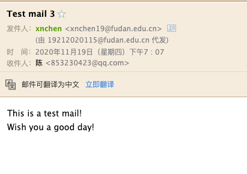

## SMTP协议

### 参考

[SMTP commends](https://www.samlogic.net/articles/smtp-commands-reference.htm)

[SMTP的相关命令](https://www.cnblogs.com/cocowool/archive/2012/03/14/2395390.html)

### 基础SMTP指令

- HELO：发送给SMTP服务器来初始化SMTP对话
- MAIL FROM：
    1. 告诉SMTP服务器，这是一个新邮件的开始；
    2. 邮件发送方地址
- RCPT TO：
    1. 确定接受方地址。可以将一个email发送给多个接收方，只要使用多次RCPT指令
- DATA：
    - 表示开始键入邮件报文
- QUIT
    - 终止和SMTP服务器的连接

### 升级的SMTP指令

- AUTH 
    - AUTH LOGIN：使用账户密码登录服务器。账户密码的发送需要使用base64编码
    - [编码在线转换](https://tool.oschina.net/encrypt?type=3)

### 邮件报文格式

指的是输入DATA指令之后的报文

必须要有的内容：

- From: nikename<xxxx@url>
- To: <xxxx@url>
- Subject: xxxxxxxxxxxx

最后使用`.`结束报文输入。

（其实from和to之前没加好像也没事（？
    
### 实例

**使用telnet与邮件服务器建立连接**

    (base) xnchen@MacbookAir:~$ telnet mail.fudan.edu.cn 25
    
    Trying 202.120.224.10...
    Connected to mail.fudan.edu.cn.
    Escape character is '^]'.
    220 fudan.edu.cn Anti-spam GT for Coremail System (fudan.edu.cn[20191216])
    HELO 19212020115 
    250 OK
    auth login
    334 dXNlcm5hbWU6
    MTkyMTIwMjAxMTVAZnVkYW4uZWR1LmNu
    334 UGFzc3dvcmQ6
    V0NERFouMTIzYQ==
    235 Authentication successful
    MAIL FROM:<19212020115@fudan.edu.cn>
    250 Mail OK
    RCPT TO:<853230423@qq.com>
    250 Mail OK
    DATA
    354 End data with <CR><LF>.<CR><LF>
    From: xnchen<xnchen19@fudan.edu.cn>
    Subject: Test mail 3
    To: 853230423@qq.com
    
    This is a test mail!
    Wish you a good day!
    .
    250 Mail OK queued as XAUFCgCHjNy1UbZfaIOPAQ--.7627S2
    
    421 closing transmission channel
    Connection closed by foreign host.
    
#### 接受方收到邮件：

---

## 接受方协议

### POP3协议

允许电子邮件客户端下载服务器上的邮件，但是在客户端的操作（如移动邮件、标记已读等），不会反馈到服务器上。比如通过客户端收取了邮箱中的2封邮件并移动到其他文件夹，邮箱服务器上的这些邮件是没有同时被移动的。

POP3按照三个阶段进行工作：
1. authorization： 用户登录。
            
        (base) xnchen@HCC-GPU-01:~$ telnet mail.fudan.edu.cn 110
        Trying 61.129.42.10...
        Connected to mail.fudan.edu.cn.
        Escape character is '^]'.
        +OK Welcome to coremail Mail Pop3 Server (fudan.edu.cns[59f7ef6796cdb7873e5a2afad57ffef7s])
        user xxxxx
        +OK core mail
        pass xxxxxx
        +OK 322 message(s) [99445281 byte(s)]
2. 事务处理：查看邮件列表、收取指定邮件、对邮件增加删除标记

        list
        +OK 322 99445281
        1 735
        2 2227
        3 2897
        4 3016
        5 3056
        6 3093
        7 3302
        8 3387
        9 3583
        10 3905
        .
        retr 1
        +OK 735 octets
        From:postmaster@fudan.edu.cn
        to:19212020115@fudan.edu.cn
        Subject: =?utf-8?B?W+WPrOWbnumCruS7tuaIkOWKn10g57qz57Gz6ZuG5oiQ55S16LevX+ivvueoi+aKpeWRil/ph4/lrZDngrlf6ZmI6Zuq5YedXzE5MjEyMDIwMTE1?=
        Content-Type: Text/Plain;
          charset="utf-8"
        Content-Transfer-Encoding: base64
        X-CM-HeaderCharset: utf-8
        MIME-Version: 1.0
        Message-Id: <5DF9A69E.002C24.03433@localhost.localdomain>
        Date: Wed, 18 Dec 2019 12:10:06 +0800 (CST)
        X-CM-TRANSID:XAUFCgAH6lKepvld3fGLAw--.38327S
        
        
        DQrlj5Hnu5loYW9femh1QGZ1ZGFuLmVkdS5jbueahOmCruS7tuWPrOWbnuaIkOWKnw0KDQoNCg0K
        KkVuZ2xpc2ggaGVyZSoNCg0KZW1haWwgc2VudCB0byBoYW9femh1QGZ1ZGFuLmVkdS5jbiBoYXMg
        YmVlbiByZWNhbGxlZCBzdWNjZXNzZnVsbHkNCg0KDQotLS0tLS0tLS0tLS0tLS0NCkdlbmVyYXRl
        ZCBieSBDb3JlbWFpbC4NCg==
        .
3. 更新：用户quit之后，结束POP3对话，并且邮件服务器删除被标记为删除的报文。
    
        quit
        +OK core mail
        Connection closed by foreign host.

### IMAP协议：

提供webmail与电子邮件客户端之间的双向通信，客户端的操作都会反馈到服务器上，对邮件进行的操作，服务器上的邮件也会做相应的动作。