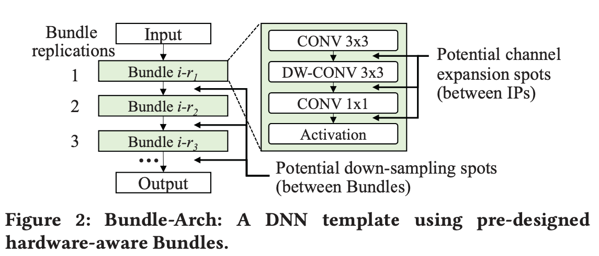
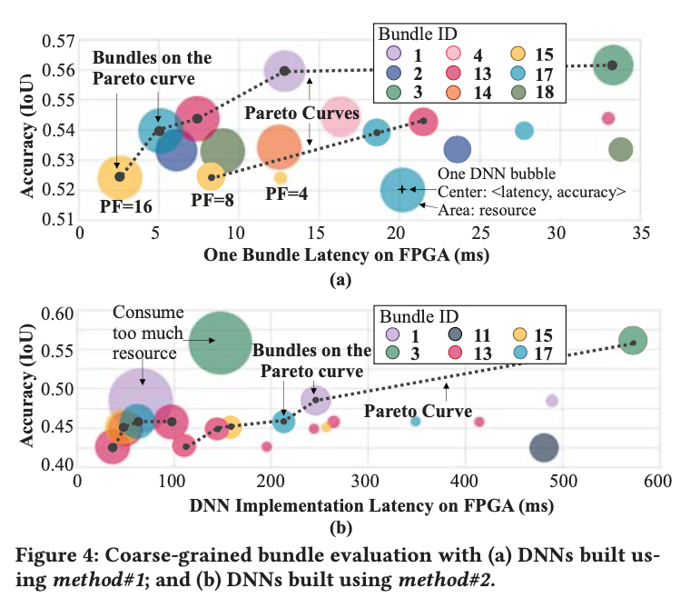
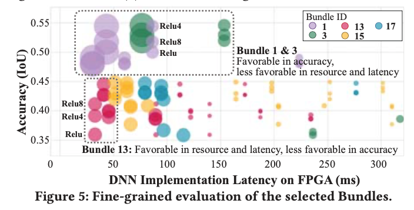
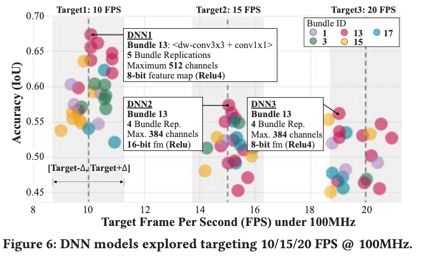

DAC19
使用SCD而不是SGD去优化神经网络。
是一个将训练和implementation分开的工作。
使用自动化工具自动生成硬件HLS
训练的时候是hardware-aware的
搜索空间感觉是2017年的风格，简单的cell堆叠就是了
硬件的论文真的难以看懂，看了也不知道他们在干什么

[TOC]

#### 摘要
本文提出了一个FPGA/DNN协同设计方法：从下到上的面向硬件的DNN模型搜索；从上到下的针对DNN特点的FPGA加速器设计。本文构建了一个自动的协同搜索设计流程，一个执行面向硬件的DNN搜索模型，和用于为搜索的DNN生成FPGA可综合C代码的Auto-HLS引擎。使用PYNQ-Z1进行对象检测任务。本文的方法在所有方面都优于最新的FPGA设计，包括IoU、FPS、power consumption和能量效率。和GPU相比，精度相似但能耗少。

#### 1.介绍

本文贡献：
- FPGA/DNN协同设计方法。
- 对于DNN模型的设计，引入DNN模板，以可预测的性能和资源利用率来指导DNN的生成。从而大大减少了搜索空间。
- 对于FPGA加速器设计，本文提出了tile-based细粒度流水线架构，可以使用高度优化的HLS IP库生成所需的DNN。在这种架构的基础上，提出自动HLS生成器Auto-HLS，直接根据dnn模型生成C代码。
- 在PYNQ-Z1开发板上进行试验。

#### 3.协同设计

##### 3.1Co-design space

搜索空间包含了FPGA和DNN设计。搜索空间的表示如下表所示：

>`L`：DNN的总层数IP1到
`IPm`：表示可用的可配置的IP模板
`p1到pn`：表示已经配置的IP实例每个IP
实例pj包括了配置参数`<PFj, Qj>`。PFj是并行参数，Qj是量化方法。
`<lj , · · · lj >`: 表示在FPGA中使用IP实例pj进行计算的层
`<fch1 , fch2 , · · · , fchL >`：DNN中通道深度的扩展（？啥意思the expansions of channel depth through the entire DNN
`ds1到dsk`：表示具有下采样因子fdsi的下采样层
这些参数可以确定DNN模型和FPGA加速器设计。

##### 3.2总体co-design流程

结构分为
对于DNN：
1. bundle-arch：硬件感知的DNN构建模块模板。
2. auto-DNN：自动搜索引擎，用于在硬件资源和性能约束下搜索DNN

对于FPGA：
3. Tile-Arch：用于DNN实现的低延迟FPGA加速器模板。
4. auto-HLS：快速的board-level design 生成器，将DNN自动映射到FPGA。

整个流程的输入包括了：
- 目标任务
- 目标FPGA和其资源限制（DSP、LUTs、memory等）
- 加速器的性能目标（例如延迟）
- 可配置的IP模板。

输出包括了面向硬件的DNN模型及其FPGA加速器。

设计流程：
1. 构建模块和DNN建模：根据DNN模块和硬件IP池，首先构造分析模型来估计硬件的latency和资源利用率，并且构造DNN。这一步在DNN搜索的早期阶段提供性能评估
2. 模块选择：autoDNN会根据lantency、资源利用和精确度执行细粒度和粗粒度评估，来选择building block进行进一步的DNN搜索。
3. 硬件感知的DNN搜索和更新：给定选中的buiding block，auto DNN使用SCD（[随机坐标下降](https://zh.wikipedia.org/wiki/%E5%9D%90%E6%A0%87%E4%B8%8B%E9%99%8D%E6%B3%95)）在给定资源和延迟约束下搜索DNN。从SCD输出的DNN被送到auto-HLS，获得更精确的性能和资源结果，并反馈给SCD进行更新。得到的候选DNN将进行训练。

#### 4.DNN和加速器模板
##### 4.1 Bundle-Arch：硬件感知的DNN模板

bundle指一个序列的DNN layer，用作基础的DNN模块。

每个bundle的输入输出通道数可能不同。

在bundle之间，使用下采样进行特征图大小压缩。

Bundle也是根据本文提出FPGA实现的Tile-Arch进行组织的，能够提供低延迟。

（其实就是NAS中的预设计cell，这使得人工DNN的智慧加入了网络，但是NAS的自由度变少了）

##### 4.2 bundle生成

为了生成候选bundle，选择了下述的IP（也就是DNN layer）：
- conv 1x1，3x3，5x5
- depth-wise conv 3x3，5x5，7x7
- max/avg pooling
- normalization
- activation

在FPGA实现中，每个IP需要至少一个实例，更多的IP意味着更多的资源开销。本文实现中，每个bundle内最多有两个计算IP，因为目标是在IoT设备上实现。

总共生成了18个bundle候选。首先需要对这些bundle进行评估，然后准确性和硬件特性最好的用于进行DNN搜索（section 5.1）。

##### 4.3 Tile-Arch：低延迟的加速器模板

tile-arch是一种细粒度的tile-based流水线加速结构，用于将DNN映射到FPGA上。该模板具有以下功能：

- layer-level IP重用：采用折叠式整体结构，DNN层通过跨层重用IP实例的方法顺序计算（这是又在说什么）。
- tile-level IP重用：因为layer-level的数据重用，各层之间的中间数据被划分为大小相同的tile，多个tile重用一个IP实例。这使得可以在IP实例间直接进行数据传输，无需片内/外存储器访问。
- tile-level流水线：由于层内的数据tile不具有数据依赖性，可以在层内和连续的层之间利用tile-level IP流水线（这又是在说什么）

在上图(a)中展示了一个top-level bundle架构。on-chip data buffer被放置在BRAM中，进行Bundle内的交流。off-chip data buffer则放在DRAM中，进行bundle间交流。(b)展示了3个tile在一个bundle内的tile-level 流水线。

##### 4.4 Bundle和DNN的性能建模

资源和latency

###### 4.4.1 bundle的性能建模

以一个bundle bundi为例，其资源为：
$$
Res^r_{bund_i} = \sum_{p_j}Res^r_{bund_i}+\Gamma^r_i
$$
前一项是bundle使用的IP实例的资源使用，后一项是控制逻辑和多路复用器使用的资源（例如LUTs）

bundle的latency为：
$$
Lat_{bund_i}=\alpha_i\cdot\sum_{p_j}Comp_j+\frac{\beta_i\cdot\Theta(Data_i)}{bw}
$$

前一项是实例pj的计算延迟， 后一项是传输off-chip数据导致的延迟。

(……实在不想看了

#### 5.DNN搜索和更新
##### 5.1 bundle的评估和选择
###### 5.1.1 粗粒度的评估

使用三个维度来评价bundle，分别是latency、resource和accuracy。其中，latency和resource在4.4章节描述了怎么计算，而accuracy则通过bundle构造DNN并训练来得到。

有两种方法使用bundle构造DNN：
1. 使用由固定头部和尾部的DNN模板，中间插入一个Bundle
2. 在DNN中重复Bundle n次

为了快速评估，每个DNN都只训练20epoch，然后在坐标图上表示：

(a)是方法1，(b)是方法2。坐标是<latency,accuracy>，半径大小是resouce。
PF指的是parallel factors，并行参数不同使得lantency和resource不一样，但是accuracy是一样的。我们会选择在pareto曲线上的bundle组合（估计是在PF相同的情况下最向左上偏的点？）

可以发现无论是方法1还是2都能到处相似的答案。

###### 5.1.2 细粒度的评估

在粗粒度评估之后，在对选取的bundle执行细粒度评估，以得到其特性。
使用方法2和不同的activation function（例如Relu4和Relu8，和数据量化方法有关）来构造DNN
下图展示了细粒度评估的结果，不同的bundle有其特征（然而加这些有什么意义呢（？

#### 5.2 硬件感知的DNN搜索和更新

就 感觉也没有很细节
为什么感觉硬件看了论文也什么都看不懂呢
这就是硬件吗

